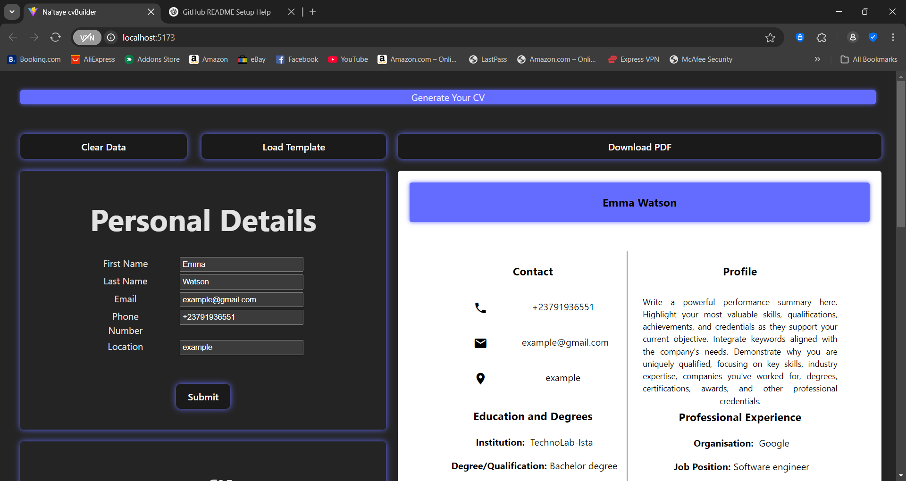

# React + Vite

# 📄 CV Generator App

A simple and elegant web app that helps users generate their professional CV by filling in personal information, education, profile summary, and work experience — then download the final result as a polished PDF.

---

## 📝 Description

The **CV Generator App** allows users to:

- Enter personal details (name, email, phone, etc.)
- Write a profile summary
- Add educational background
- List work experience
- Preview the CV live as they type
- Download the completed CV as a **PDF**

Built using modern tools for a fast and dynamic user experience.

---

## ⚙️ Features

- 🖊️ Interactive form for adding CV details
- 📄 Live CV preview in real-time
- 🧠 Dynamic sections for:
  - Personal info
  - Profile summary
  - Education
  - Experience
- 📥 One-click **PDF download** of the final CV
- ⚡ Built with performance in mind using **Vite**

---

## 🛠 Tech Stack

- **Frontend Framework:** [React.js](https://react.dev/)
- **Build Tool:** [Vite.js](https://vitejs.dev/)
- **PDF Export:** `html2pdf.js` or similar (for PDF conversion)
- **Styling:** CSS / Tailwind CSS *(if used)*

---
